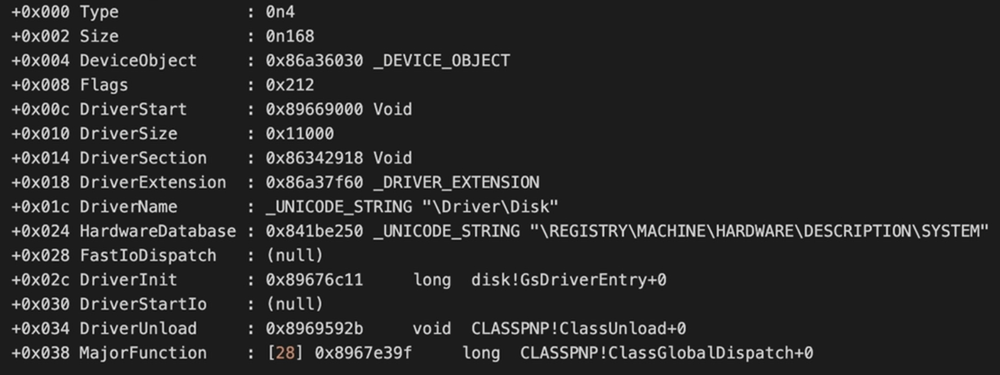
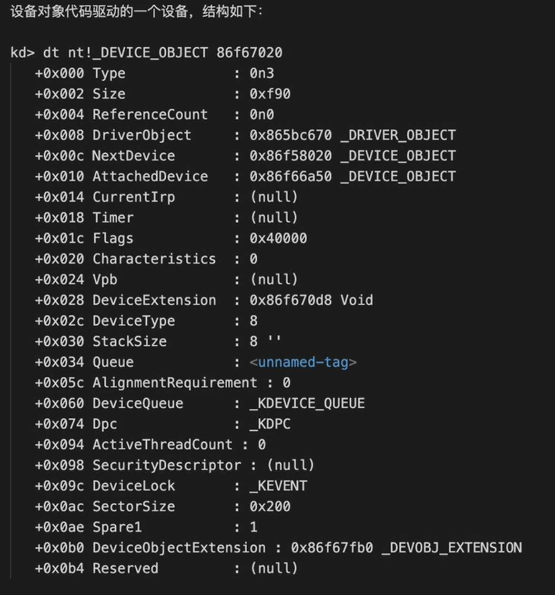

# csandbox

Sandbox技术 存储的虚拟化    Window、LInux、Android


[1、DriverBooster 内核修改线程优先级demo](DriverBooster)


# Windows驱动之驱动对象和设备对象

在Windows驱动开发中,最重要的三个数据结构是驱动对象、设备对象和IRP; 本文我们来探讨一下设备对象和驱动对象的结构


## 1、 驱动对象

在Windows中、 驱动对象的结构体如下:



```
kd> dt nt!_DRIVER_OBJECT 86a37eb8


typedef struct _DRIVER_OBJECT {
  CSHORT             Type; 							// 对象的类型，作为驱动对象，这个类型为IO_TYPE_DRIVER
  CSHORT             Size; 							// 整个对象的大小
  PDEVICE_OBJECT     DeviceObject;					// 设备对象的指针；对于一个驱动中创建的设备对象（IoCreateDevice），都是通过这个结构体和设备对象中的指针串起来
  ULONG              Flags;							// 这个标记作用暂时未知
  PVOID              DriverStart;					// 驱动文件加载到内存中的地址
  ULONG              DriverSize;					// 驱动文件的大小， 这个是映射到内存中的大小，例如如下： 
  PVOID              DriverSection;					// 这个是一个比较神奇的结构， 在很多地方都没有讲明白这个结构， 其实这个结构是一个LDR_DATA_TABLE_ENTERY的结构；Window系统中，所有的驱动都是通过这个结构串联起来。因此这里诞生出来一种猥琐的方法，就是摘除这个结构隐藏驱动，结构如下：
  PDRIVER_EXTENSION  DriverExtension;				// 这个是驱动的扩展数据，结构（主要是AddDevice的回调函数）
  UNICODE_STRING     DriverName;					// 驱动对象的面子 例如: "Driver\Disk"
  PUNICODE_STRING    HardwareDatabase;				// 硬件数据库路径
  PFAST_IO_DISPATCH  FastIoDispatch;				// FastIo历程，这个是专门给文件系统使用的
  PDRIVER_INITIALIZE DriverInit;					// 驱动入口函数， 也就是DriverEntry
  PDRIVER_STARTIO    DriverStartIo;					// 这个指向串行出来的IO请求函数
  PDRIVER_UNLOAD     DriverUnload;					// 驱动的卸载回调历程， 如果驱动没有设置这个回调函数，那么驱动将不支持卸载
  PDRIVER_DISPATCH   MajorFunction[IRP_MJ_MAXIMUM_FUNCTION + 1]; //  驱动IRP的分发函数，支持各种IRP的回调操作
} DRIVER_OBJECT, *PDRIVER_OBJECT;
	
```


## 2、 设备对象




```
typedef struct _DEVICE_OBJECT {
  CSHORT                   Type;
  USHORT                   Size;
  LONG                     ReferenceCount;
  struct _DRIVER_OBJECT    *DriverObject;						// 指向驱动对象， 每个设备对象附属于驱动对象存在，这个指针就是指向对应的驱动对象
  struct _DEVICE_OBJECT    *NextDevice;							// 下一个设备对象，驱动对象可能会创建很多的设备对象，所有的设备对象都是通过这个结构串联起来
  struct _DEVICE_OBJECT    *AttachedDevice;						// 这个对象的上层设备对象，当我们发送IRP的时候，就会影子这个指针知道设备对象的顶端，从顶端开始发送IRP
  struct _IRP              *CurrentIrp;							// 这个结构体指向StartIO当前正在出来的IRP
  PIO_TIMER                Timer;	
  ULONG                    Flags;								// 代表设备的属性fLag目1. DO_BUFFERED IO读写操作使用缓冲方式 (系统复制缓冲区) 访问用户模式数据 2. DO_EXCLUSIVE一次只允许一个线程打开设备句柄3. DO_DIRECT_IO读写操作使用直接方式(内存描述符表) 访问用户模式数据
  ULONG                    Characteristics;
  __volatile PVPB          Vpb;
  PVOID                    DeviceExtension;						//	设备的扩展部分， 用来驱动中各个函数交换的上下文
  DEVICE_TYPE              DeviceType;							//  设备类型
  CCHAR                    StackSize;							//  从当前设备开始，到PDO的设备栈数目 （也就是是设备的个数）
  union {
    LIST_ENTRY         ListEntry;
    WAIT_CONTEXT_BLOCK Wcb;
  } Queue;
  ULONG                    AlignmentRequirement;
  KDEVICE_QUEUE            DeviceQueue;							//  串行IO使用的设备队列
  KDPC                     Dpc;									//  设备的DPC队列
  ULONG                    ActiveThreadCount;
  PSECURITY_DESCRIPTOR     SecurityDescriptor;					//  设备的安全描述符
  KEVENT                   DeviceLock;
  USHORT                   SectorSize;							//  sector的大小， 对于文件型对象这个是扇区的大小是512
  USHORT                   Spare1;
  struct _DEVOBJ_EXTENSION *DeviceObjectExtension;				//  设备对象的扩展
  PVOID                    Reserved;
} DEVICE_OBJECT, *PDEVICE_OBJECT;
```


